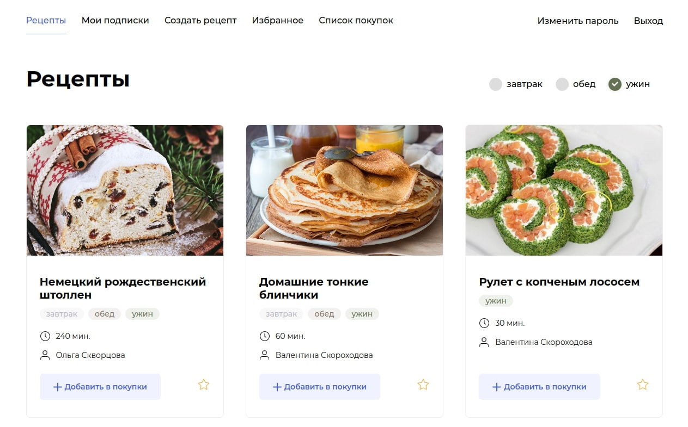

# FoodieHub 🍽️ - персональный продуктовый помощник

<br/>

FoodieHub - это онлайн-сервис и API для гурманов и любителей кулинарии. Проект предоставляет возможность создавать и
публиковать любимые рецепты, а также находить рецепты других авторов. Пользователи могут подписываться на авторов,
составлять список избранных блюд и скачивать сводный список продуктов, необходимых для приготовления выбранных рецептов.

Проект задеплоен на удалённом сервере в Docker контейнерах с использованием nginx, PostgreSQL и Gunicorn. Процесс
обновления и развертывания проекта полностью автоматизирован для удобства управления и поддержки.



### Стек проекта


[](https://github.com/features/actions)
[](https://gunicorn.org/)
[](https://github.com/davesque/django-rest-framework-simplejwt)
[](https://github.com/jpadilla/pyjwt)
[](https://github.com/sunscrapers/djoser)
[](https://www.docker.com/)
[](https://www.docker.com/products/docker-hub)
[](https://github.com/kluevevga/FoodieHub/blob/master/LICENSE)
[](https://github.com/kluevevga/FoodieHub)


### Каталоги

1. 📁 **frontend:** файлы, необходимые для сборки фронтенда приложения.
2. 📁 **infra:** конфигурационные файлы для настройки серверной инфраструктуры, включая конфигурацию Nginx и файл
   docker-compose.
3. 📁 **backend:** файлы, необходимые для сборки и запуска бэкенд-приложения.
4. 📁 **postman:** коллекция эндпоинтов для Postman, что облегчает разработку и выполнение API тестов.
5. 📁 **docs:** документация представлена в формате Redoc.

### Установка и Запуск Backend API на хосте

Для того чтобы установить и запустить бэкенд API локально, выполните следующие шаги:

1. Клонируйте проект:

```shell
git clone https://github.com/kluev-evga/foodgram-project-react.git
```

2. Создайте файл .env с тестовыми переменными в корне проекта:

```dotenv
SECRET_KEY=django-insecure-_u(dlspjs)6n28(sfn_6efk!qdn-gt5k5=d#=5sr7=2-z=!)%r
DEBUG=True
ALLOWED_HOSTS=
CSRF_TRUSTED_ORIGINS=
```

3. Установите виртуальное окружение и активируйте его:
    * PowerShell (Windows):

   ```shell
   python -m venv venv
   .\venv\Scripts\activate
   ```

    * Git Bash (Windows), Linux, Mac:
   ```shell
   python -m venv venv
   source venv/Scripts/activate
   ```
4. Перейдите в папку с проектом и установите зависимости:

```shell
cd .\backend\
pip install -r requirements.txt
```

5. Выполните миграции и запустите сервер:

```shell
python3 manage.py migrate
python3 manage.py runserver
```

По умолчанию, проект будет доступен по адресу: http://127.0.0.1:8000/, а также будет испозоваться sqlite для упрощения
работы с проектом.

6. Дополнительно, вы можете добавить тестовые данные из CSV или JSON:

```shell
python3 manage.py csv
python3 manage.py json
```

### CI / CD

Workflow pipeline выполнен при помощи github action и состоит за основного workflow main.yml
Для использования workflow необходимо в настройках репозитория указать следующий набор переменных:

```dotenv
# github -> settings -> Secrets and variables

DEBUG                 # False
SECRET_KEY            # секретный ключ django
ALLOWED_HOSTS         # example.com, - DNS сервера + ","
CSRF_TRUSTED_ORIGINS  # example.com, - DNS сервера + ","

DOCKER_USERNAME       # имя пользователя на dockerhub
DOCKER_PASSWORD       # dockerhub password

HOST                  # ip адрес сервера
USER                  # имя пользователя на сервере
SSH_KEY               # закрытый ssh ключ для доступа на сервер                        
PASSPHRASE            # кодовая фраза привязанная к ключу

POSTGRES_DB           # recipes - любое имя для базы данных
POSTGRES_USER         # postgres - пользователь postgres (используем по умолчанию)
POSTGRES_PASSWORD     # пароль пользователя postgres (придумываем любой)
DB_HOST               # db - используем db - как указано в docker compose
DB_PORT               # 5432

TELEGRAM_TO           # id бота на которого отправить сообщение об успешном деплое
TELEGRAM_TOKEN        # токен бота
```

### Деплой на сервер

Подключиться к серверу

```shell
ssh user_name@server_ip
```

Установить докер

```shell
sudo apt update
sudo apt upgrade
sudo apt install docker.io
```

Скопировать папку infra в домашний каталог

```shell
# ~ /infra/
# В папке infra должно быть 2 файла:  
nginx.conf
docker-compose.production.yml
```

При первом деплое выполнить команды

```shell
sudo docker compose -f docker-compose.production.yml exec backend python manage.py migrate
sudo docker compose -f docker-compose.production.yml exec backend python manage.py createsuperuser
sudo docker compose -f docker-compose.production.yml exec backend python manage.py collectstatic
sudo docker compose -f docker-compose.production.yml exec backend python manage.py csv
```

### Настройка SSL сертификата 🚧

1. Docker

```yaml
nginx:
  ports:
    - "80:80"
    - "443:443"
  volumes:
    - ./certbot/www:/var/www/certbot/
    - ./certbot/conf/:/etc/nginx/ssl/

certbot:
  image: certbot/certbot:latest
  volumes:
    - ./certbot/www/:/var/www/certbot/
    - ./certbot/conf/:/etc/letsencrypt/
```

2. Создаем файл конфигурации nginx.conf

`не забываем указать свои dns`

```nginx configuration
server {

    listen 80;
    listen [::]:80;
    server_name foodgram-project.dynnamn.ru www.foodgram-project.dynnamn.ru;
    server_tokens off;

    location /.well-known/acme-challenge/ {
        root /var/www/certbot;
    }

    location / {
        return 301 https://foodgram-project.dynnamn.ru$request_uri;
    }
}
```

3. Запускаем команду, чтобы заполнить папку сертификатов:

`не забываем указать свои dns`

```shell
sudo docker compose run --rm  certbot certonly --webroot --webroot-path /var/www/certbot/ -d example.com
```

4. Теперь, когда нас есть сертификаты, можно заполнить блок 443:

`не забываем указать свои dns`  
После обновления nginx.conf необходимо перезапустить контейнер nginx

```nginx configuration
server {
    listen 80;
    listen [::]:80;
    server_name example.com www.example.com;
    server_tokens off;

    location /.well-known/acme-challenge/ {
        root /var/www/certbot;
    }

    location / {
        return 301 https://foodgram-project.dynnamn.ru$request_uri;
    }
}

server {
    listen 443 default_server ssl http2;
    listen [::]:443 ssl http2;
    server_name example.org;
    ssl_certificate /etc/nginx/ssl/live/example.org/fullchain.pem;
    ssl_certificate_key /etc/nginx/ssl/live/example.org/privkey.pem;

    location / {
    	# ... заполняем все необходимые пути
    }
}
```

### Обновление сертификата

```shell
sudo docker compose run --rm certbot renew
```

<br/>

## Лицензия 📜

Этот проект распространяется под лицензией `MIT`. Дополнительную информацию можно найти
в [LICENSE](https://github.com/kluevevga/FoodieHub/blob/master/LICENSE).